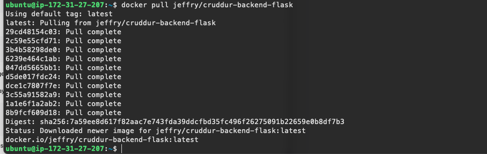
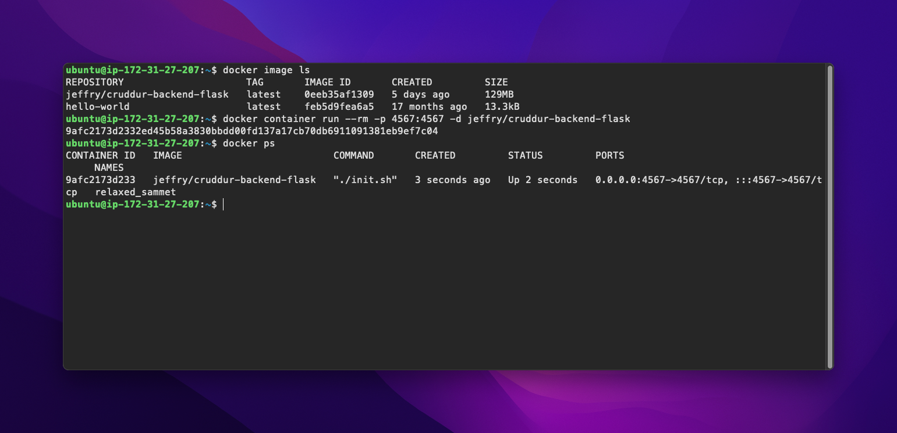
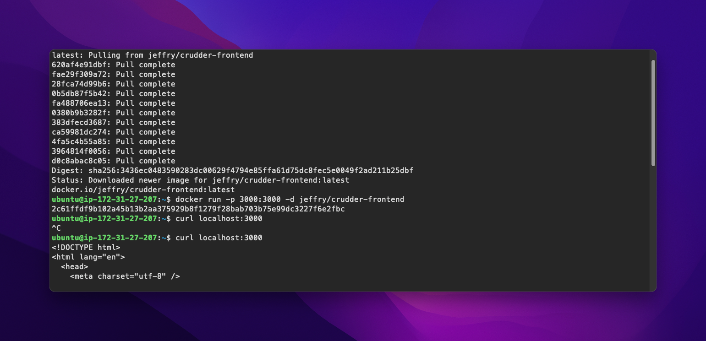

# Week 1 — App Containerization


## Homework

To run the backend container I preferred to use the —env-file option for docker, creating a env-list file that contains all my env variables.

```lua
docker container run --rm --env-file ./env-list -p 4567:4567  jeffry/cruddur-backend-flask
```

</br>
</br>
</br>
Run the dockerfile CMD as an external script I’ve created a [init.sh](http://init.sh) script containing the flask run command.
I tried to use both CMD and ENTRYPOINT to run the init.sh script. Both worked successfully.
I prefer to use ENTRYPOINT option because the image is dedicated to run the flask command.
</br>
</br>
</br>

I already had a docker hub account so I used it as repository for my cruddur-backend-flask image: 
[https://hub.docker.com/repository/docker/jeffry/cruddur-backend-flask/general](https://hub.docker.com/repository/docker/jeffry/cruddur-backend-flask/general)
</br>
</br>
</br>


For the sake of learning I’ve modified the ******************frontend-react-js****************** dockerfile using the multi-stage building strategy.
I haven’t noticed before that the docker compose mounts the host machine folder inside the container, so I had some trouble till noticed that I had to *npm i* every time to make it works.
</br>
</br>
</br>


To implement healtchecks in both the services I had to install curl the backend service, modifying the dockerfile.
I’ve used [http://localhost:4567/api/message_groups](http://localhost:4567/api/message_groups) as endpoint for the backend service and [http://localhost:3000](http://localhost:3000/) for the frontend service
Valuate the health using the docker inspect command, looking for the Health value.
</br>
</br>
</br>


I’ve already installed docker and docker desktop on my local machine so I went on Amazon to do it from scratch.

In the Amazon Marketplace there are different AMI prebuild with docker but I prefer to go on with a official ubuntu or AmazonLinux AMI.

I’ve launched an EC2 instance, installed docker following the installation guide [https://docs.docker.com/engine/install/ubuntu/](https://docs.docker.com/engine/install/ubuntu/)

Than pulled one of my container from dockerhub and started.







</br>
</br>
</br>

## Security Container

Watched the Top 10 Docker Container Security Best Practices with Tutorial video.
Found interesting. Tried out synk cloud and sync CLI and scanned my Cruddur repository. 
Found out some critical vunerabilities due to old node version base image. Didn’t updated cause I’m going to follow the course 🙂

Checked also Amazon Inspector and Hashicorp Vault. Didn’t try them because I wanna keep the bills low as possibile. I’m interested to try Hashicorp Vault in the future because it is cloud agnostic