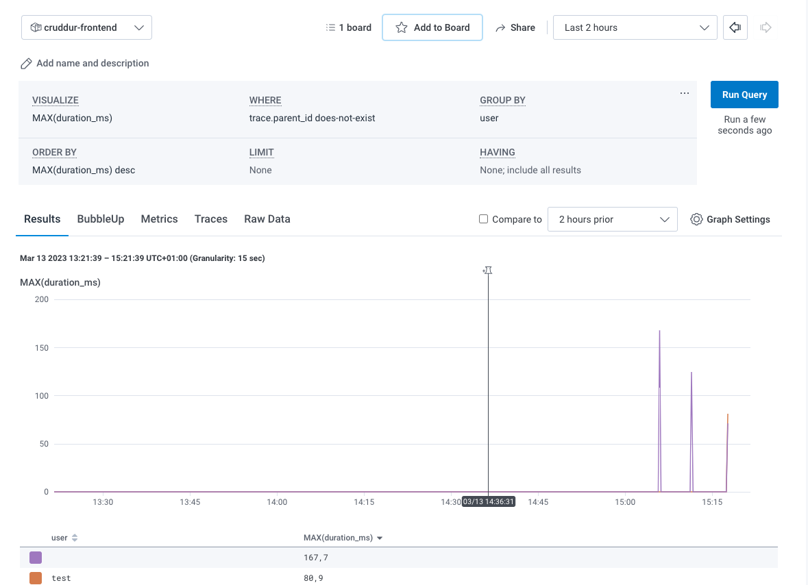

# Week 2 — Distributed Tracing

# Journal

All the Technical Tasks has been done following the youtube video.
The only difficult found was about the subsegment tracing of AWS X-Ray but I’ve found out how to implement it and how to associate custom metadata. I’ve seen later that a solution video has been posted. Late 🙂

## Homework Challenge

Instrumented Honeycomb to trace both frontend and backend

It has been really hard. I had to fix CORS problem and to deploy the Otel collector container to gather the front-end trace.

Right now I’ve left the OtelCOllector CORS open to a [gitpod.io](http://gitpod.io) wildcard origins. 
In production I’d fix it setting the right origin.

It is also visible the custom span related to fetch the mocked data.

The honeycomb guide is not very straightforward. I’ve google a lot to understand how to implement it.

I added also a fake “user ID” attributes to be able to run custom queries to find out the latency by UserID.

