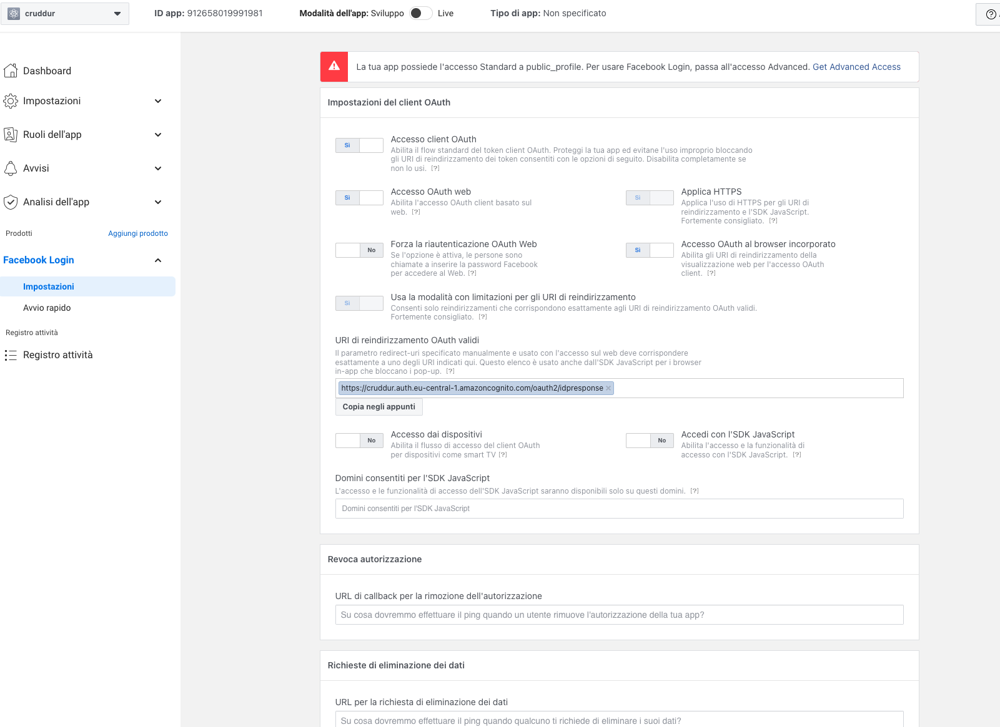
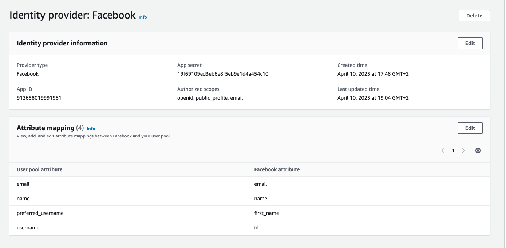
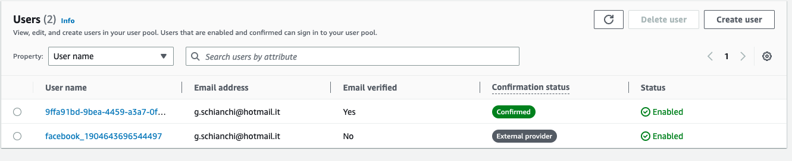
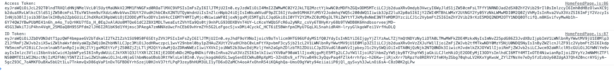

# Week 3 — Decentralized Authentication
I’ve completed all the standard to do task.

### Decouple JWT Verify - Middleware

I’ve decoupled the JWT verify from the application code writing a middleware ***authz.py*** inside the middleware folder. I’ve coded a wrapper called ***cognito_verify_jwt_with_token.***
I’ve wrapped the */api/activities/notifications* route to test it, in that way I haven’t modified the */api/activities/home* implementation done during the live stream.
I’ve also modified the front-end part ************************NotificationFeedPage.js************************ to pass the authorization token and to check if the user is authorized.
Everything works 🙂

### Decouple JWT Verify - Container Sidecar

Never used NodeJS and ExpressJS. Something cool to learn 🙂

Created a folder called `jwt-verify-sidecar` containing the container sidecar that implement the JWT verification using the **********aws-jwt-verify********** library.

Implemented 2 different API to test both method: GET with token passeed through header or POST to verify the token passed via json body.
Both can be found inside `server.js` that contains the node express js server.

After testing ******locally******, I’ve dockerized the container and added the configuration in the docker-compose file too.

Dockerfile:

```docker
FROM node:16.18

ENV PORT=9001

COPY . /jwt-verify-sidecar
WORKDIR /jwt-verify-sidecar
RUN npm install
EXPOSE ${PORT}
CMD ["node", "server.js"]
```

Than i created a middleware called `cognito_verify_jwt_via_sidecar_given_token` inside the ***********middleware*********** folder.
I’ve duplicated the */api/activities/notifications* to test the new middleware.

```python
@app.route("/api/activities/notifications", methods=['GET'])
@cognito_verify_jwt_via_sidecar_given_token(cognito_jwt_token, app)
def data_notifications():
  data = NotificationsActivities.run()
  return data, 200
```

Everything works. 

### Decouple JWT Verify - Envoy

It has been an hard task.
Never used Envoy so I had to read the docs and tried to figure out how it works.
Fewer hours later, and much more Google and ChatGPT prompt, I figured out how to implement it. 🙂

I’ve created a new folder called *****envoy***** that contains the envoy’s configuration yaml file.
Than I added the envoy service in the docker compose file.

I used Envoy as a proxy between front-end and back-end to validate the JWT token.
I’ve tested it with the ************************NotificationFeedPage.js,************************ duplicating the */api/activities/notifications,* commenting the old one.
To use the Envoy container as proxy I had to modify the `backend_url` with the new envoy url, passed as env variable.

Everything works. 🙂

### Implement a IdP login eg. Login with Facebook

This is hardest task in my opinion.

I’ve configured the Facebook App and the facebook login via facebook dev console: 



Than configured the Identity Provider on AWS Cognito:



Via the following link is possible to authenticate via Facebook IDP:

https://cruddur.auth.eu-central-1.amazoncognito.com/login?response_type=code&client_id=5nvou0p7c39cbhvhjad9sm4ud5&redirect_uri=https://3000-jeffr89-awsbootcampcrud-ypj7wgkcewv.ws-eu93.gitpod.io/

It correctly add the user in the pool.



Than the auth return to the Cruddur homepage with the “access code” that I had converted via a Cognito API into the JWT of the user as visible in the console log.



Right now I’m using the random domain name of gitpod so It is necessary to update the URL on Facebook Dev console and AWS cognito console every time I restart the workspace.

I will update it soon with a custom domain for the cruddur app.

Unfortunately I can’t go on with the implementation. I’m stuck during the implementation of the front-end part cause my low react knowledge.